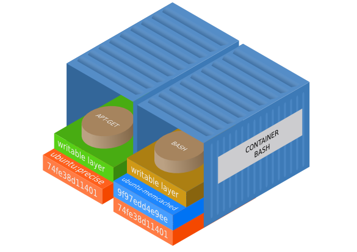

class: center, middle

# Docker, what is all about

Intellectsoft LTD

---
class: center, middle
# Who I am

--

Full-stack developer at Intellectsoft LTD.

http://github.com/fesor

---
class: center, middle
# Why Docker?

---
class: center, middle
# All cool guys use docker!

---
class: center, middle
# Just kidding

---
class: center, middle
# 90's

---
class: center, middle
background-image: url(img/bad_processes.jpg)
background-size: cover
background-position: 50% 50%

---
class: center, middle
## XP

--
## Adaptive Software Development

--
## Agile Software Development Manifesto

--
## Lean

---
class: center, middle

## BSD Jail

--
## Sun Solaris Container

--
## OpenVZ

---
class: center, middle

## LXC, cgroups, namespaces...

---
class: center, middle


---
class: center, middle

# DevOps

---
class: center, middle

# Continuous Delivery

---
class: center, middle
# Puppet, Chief, Ansible

---
class: center, middle
# Vagrant

---
class: center, middle


---
class: center, middle

# We need a ~~hero~~ new tool

---
class: center, middle
# Docker!

---
# Docker

todo: Draw how it works

---
class: center, middle
# Unix: everything is a file

---
class: center
# UnionFS

--


---
class: larger-code
# Dockerfile

```dockerfile
FROM php:7.0-fpm
RUN apt-get update && \
    apt-get install -y libmcrypt-dev libpq-dev netcat

RUN docker-php-ext-install \
        mcrypt \
        bcmath \
        mbstring \
        zip \
        opcache \
        pdo pdo_pgsql

COPY . /srv/

WORKDIR /srv
CMD ["bash", "boot.sh"]
```
---
class: center
# Dockerfile



---

class: larger-code
# Dockerfile

```dockerfile
*FROM php:7.0-fpm
RUN apt-get update && \
    apt-get install -y libmcrypt-dev libpq-dev netcat

RUN docker-php-ext-install \
        mcrypt \
        bcmath \
        mbstring \
        zip \
        opcache \
        pdo pdo_pgsql

COPY . /srv/

WORKDIR /srv
CMD ["bash", "boot.sh"]
```
---
class: larger-code
# Dockerfile

```dockerfile
FROM php:7.0-fpm
RUN apt-get update && \
    apt-get install -y libmcrypt-dev libpq-dev netcat

*RUN docker-php-ext-install \
*       mcrypt \
*       bcmath \
*       mbstring \
*       zip \
*       opcache \
*       pdo pdo_pgsql

COPY . /srv/

WORKDIR /srv
CMD ["bash", "boot.sh"]
```
---
class: larger-code
# Dockerfile

```dockerfile
FROM php:7.0-fpm
RUN apt-get update && \
    apt-get install -y libmcrypt-dev libpq-dev netcat

RUN docker-php-ext-install \
        mcrypt \
        bcmath \
        mbstring \
        zip \
        opcache \
        pdo pdo_pgsql

COPY . /srv/

*WORKDIR /srv
*CMD ["bash", "boot.sh"]
```

---
class: larger-code
# Docker Build

```bash

```

---

# Dockviz

```
├─sha256:b5c41 Virtual Size: 495.8 MB Tags: php:7.0-fpm
│ ├─sha256:a921a Virtual Size: 495.8 MB
│ │ └─sha256:8ed59 Virtual Size: 495.8 MB Tags: hotswap_php:latest
│ └─sha256:13276 Virtual Size: 541.8 MB
│   ├─sha256:734c2 Virtual Size: 544.2 MB
│   │ ├─sha256:21df5 Virtual Size: 592.9 MB Tags: localhost:5000/myproj/php:latest
│   │ └─sha256:505d6 Virtual Size: 592.9 MB Tags: my_proj_php:latest
│   └─sha256:2bc23 Virtual Size: 544.2 MB
│     ├─sha256:78ca0 Virtual Size: 588.5 MB Tags: nda_php:latest
│     ├─sha256:4821c Virtual Size: 593.6 MB Tags: todoapp_php:latest
│     └─sha256:d4079 Virtual Size: 593.6 MB Tags: devops_php:latest
```

---
class: larger-code
# Start Container?

```bash
docker run --name test -it debian
```

---

# Start Container

```bash
#!/usr/bin/env bash

# Disable xdebug in production environment
xdebug_config=/usr/local/etc/php/conf.d/xdebug.ini
if [ -f $xdebug_config ] && [ "$SYMFONY_ENV" == "prod" ]
    then
        rm $xdebug_config
fi

# Wait for postgres to start
echo -n "waiting for TCP connection to database:..."
while ! nc -z -w 1 database 5432 2>/dev/null
do
  echo -n "."
  sleep 1
done

# Prepare application
app/console cache:clear
php-fpm
```

---
# Start Container

```bash
#!/usr/bin/env bash

# Disable xdebug in production environment
xdebug_config=/usr/local/etc/php/conf.d/xdebug.ini
if [ -f $xdebug_config ] && [ "$SYMFONY_ENV" == "prod" ]
    then
        rm $xdebug_config
fi

# Wait for postgres to start
*echo -n "waiting for TCP connection to database:..."
*while ! nc -z -w 1 database 5432 2>/dev/null
*do
* echo -n "."
* sleep 1
*done

# Prepare application
app/console cache:clear
php-fpm
```

---
# Start Container

```bash
#!/usr/bin/env bash

# Disable xdebug in production environment
*xdebug_config=/usr/local/etc/php/conf.d/xdebug.ini
*if [ -f $xdebug_config ] && [ "$SYMFONY_ENV" == "prod" ]
*   then
*       rm $xdebug_config
*fi

# Wait for postgres to start
echo -n "waiting for TCP connection to database:..."
while ! nc -z -w 1 database 5432 2>/dev/null
do
  echo -n "."
  sleep 1
done

# Prepare application
*app/console cache:clear
*php-fpm
```

---

# Docker Compose

```yaml
# docker-compose.yml
version: "2"

services:
    php:
        build: '.'
        depends_on:
            - database
        env_file: .env
        volumes:
            - '.:/srv'

    database:
        image: postgres:9.4
        env_file: .env
        volumes:
            - dbdata:/var/lib/postgresql

volumes:
    dbdata:
        driver: local
```

---

# Docker Compose

```yaml
# docker-compose.yml
version: "2"

services:
    php:
        build: '.'
        depends_on:
            - database
        env_file: .env
        volumes:
            - '.:/srv'

    database:
        image: postgres:9.4
        env_file: .env
        volumes:
            - dbdata:/var/lib/postgresql

volumes:
    dbdata:
        driver: local
```

---

# Split services configuration

```yaml
# docker-compose.test.yml
version: "2"

services:
    php:
        tty: true
        environment:
            SYMFONY_ENV: test

    database:
        volumes: []

    maildev:
        image: djfarrelly/maildev:0.12.1
```

---
class: larger-code
# Multiple Docker Compose files

```terminal
docker-compose  -f 'docker-compose.yml' \
                -f 'docker-compose.test.yml' up -d
```


---

# Multiple Docker Compose files

```yaml
# result
version: "2"

services:
    php:
        build: '.'
        depends_on:
         - database
        env_file: .env
        volumes:
         - '.:/srv'
        tty: true
        environment:
            SYMFONY_ENV: test

    database:
        image: postgres:9.4
        env_file: .env

    maildev:
        image: djfarrelly/maildev:0.12.1
```
