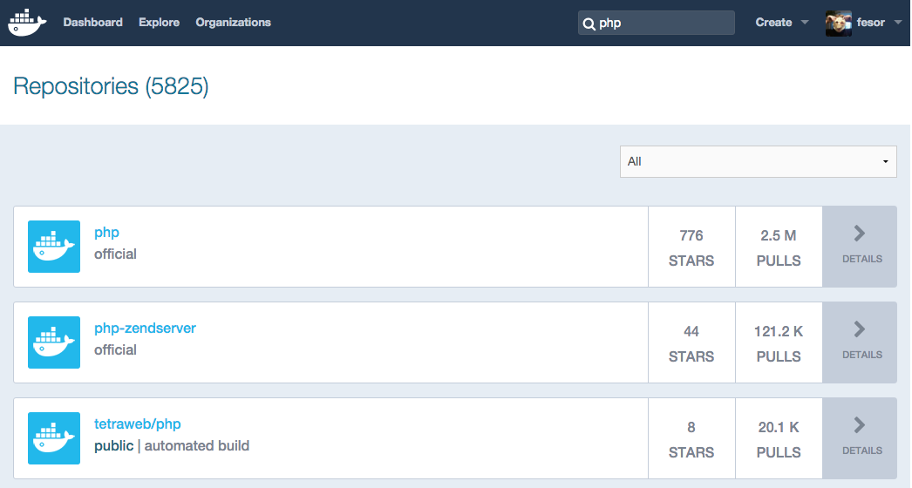

class: center, middle

# Docker, what is all about

Intellectsoft LTD

---
class: right, bottom, bg-cover, who-i-am
background-image: url(img/dump.jpg)
# Who I am

Full-stack developer at Intellectsoft LTD.

http://github.com/fesor

---
class: center, middle
# Why Docker?

---
class: center, bg-cover, bg-right
background-image: url(img/cool_guy.jpg)
# All cool guys use docker!

---
class: right, bottom, bg-cover, img-slide, dark
background-image: url(img/blog-banner-dr-evil.png)

# Right...

---
class: center, middle
# 90's

---
class: center, middle
### Adaptive Software Development

## Extreme Programming

# Agile

## Lean

---
class: center
# Iterative development

.img-60[]

---
class: center, middle, bg-cover, text-overlay
background-image: url(img/maxresdefault.jpg)
# Microservices!

---
class: center, middle

## BSD Jail

## Sun Solaris Container

## OpenVZ

---
class: center, middle

## LXC, cgroups, namespaces...

---
class: center, middle
# Puppet, Chief, Ansible

---
class: center, middle
.img-80[]

---
class: center, bottom, bg-cover, img-slide, large-headers, dark
background-image: url(img/devops.jpg)
# DevOps

---
class: center, middle
# Vagrant

---
class: center, middle


---
class: center, middle

# Continuous Delivery

---
class: center, middle

# We need a ~~hero~~ new tool

---
class: center, middle
# Docker!

---
class: center
.docker-logo[]


---
class: center, middle
# Unix: everything is a file

---
class: center, middle
# UnionFS

### BtrFS, AuFS, OverlayFS
---
class: larger-code
# Dockerfile

```dockerfile
FROM php:7.0-fpm
RUN apt-get update && \
    apt-get install -y libmcrypt-dev libpq-dev netcat

RUN docker-php-ext-install \
        mcrypt bcmath mbstring zip \
        opcache pdo pdo_pgsql

COPY . /srv/

WORKDIR /srv
CMD ["bash", "boot.sh"]
```

---
class: center, middle

# Dockerfile and Layers
.img-80[]


---

class: larger-code
# Dockerfile

```dockerfile
*FROM php:7.0-fpm
RUN apt-get update && \
    apt-get install -y libmcrypt-dev libpq-dev netcat

RUN docker-php-ext-install \
        mcrypt bcmath mbstring zip \
        opcache pdo pdo_pgsql

COPY . /srv/

WORKDIR /srv
CMD ["bash", "boot.sh"]
```
---
class: larger-code
# Dockerfile

```dockerfile
FROM php:7.0-fpm
RUN apt-get update && \
    apt-get install -y libmcrypt-dev libpq-dev netcat

*RUN docker-php-ext-install \
*       mcrypt bcmath mbstring zip \
*       opcache pdo pdo_pgsql

COPY . /srv/

WORKDIR /srv
CMD ["bash", "boot.sh"]

```
---
class: larger-code
# Dockerfile

```dockerfile
FROM php:7.0-fpm
RUN apt-get update && \
    apt-get install -y libmcrypt-dev libpq-dev netcat

RUN docker-php-ext-install \
        mcrypt bcmath mbstring zip \
        opcache pdo pdo_pgsql

COPY . /srv/

WORKDIR /srv
*CMD ["bash", "boot.sh"]
```

---
class: larger-code, command-example
# Docker Build

```bash
docker build -t myproject/php:latest .

```

---
class: larger-code
# Dockviz

```
├─sha256:b5c41: 495.8 MB Tags: php:7.0-fpm
│ ├─sha256:a921a: 495.8 MB
│ │ └─sha256:8ed59: 495.8 MB Tags: hotswap_php:latest
│ └─sha256:13276: 541.8 MB
│   ├─sha256:734c2: 544.2 MB
│   │ ├─sha256:21df5: 592.9 MB Tags: repo:5000/myproj/php:latest
│   │ └─sha256:505d6: 592.9 MB Tags: my_proj_php:latest
│   └─sha256:2bc23: 544.2 MB
│     ├─sha256:78ca0: 588.5 MB Tags: nda_php:latest
│     ├─sha256:4821c: 593.6 MB Tags: todoapp_php:latest
│     └─sha256:d4079: 593.6 MB Tags: devops_php:latest
```

---
class: middle, center
# Single Responsibility
---
class: command-example, larger-code, command-example, middle
# Start Container

```bash
docker run --name test -it --rm \
       myproject/php:latest
```

---

# Start Container...

```bash
#!/usr/bin/env bash

# Disable xdebug in production environment
xdebug_config=/usr/local/etc/php/conf.d/xdebug.ini
if [ -f $xdebug_config ] && [ "$SYMFONY_ENV" == "prod" ]
    then
        rm $xdebug_config
fi

*# Wait for postgres to start
*echo -n "waiting for TCP connection to database:..."
*while ! nc -z -w 1 database 5432 2>/dev/null
*do
* echo -n "."
* sleep 1
*done

# Prepare application
app/console cache:clear
php-fpm -R
```

---
# Start Container

```bash
#!/usr/bin/env bash

# Disable xdebug in production environment
*xdebug_config=/usr/local/etc/php/conf.d/xdebug.ini
*if [ -f $xdebug_config ] && [ "$SYMFONY_ENV" == "prod" ]
*   then
*       rm $xdebug_config
*fi

# Wait for postgres to start
echo -n "waiting for TCP connection to database:..."
while ! nc -z -w 1 database 5432 2>/dev/null
do
  echo -n "."
  sleep 1
done

# Prepare application
*app/console cache:clear
*php-fpm -R
```

---
class: middle larger-code, command-example
# Volumes

--

```
docker run -it  --rm                          \
*      -v '/var/lib/postgresql'               \
*      -v 'configs:/etc/postgresql/9.4/main/' \
       postgres:9.4
```

---
class: center, middle

# Named Volumes

### No more data-only container madness

---

class: center, middle, larger-code, command-example

# Named Volumes

```
docker volume create dbdata --driver local
```

---

class: middle, larger-code, command-example

# Named Volumes

```
docker run -it  -rm                    \
*      -v 'dbdata:/var/lib/postgresql' \
       postgres:9.4
```

---
class: center, middle
# Networking

---
class: center, middle
# Networking: Container


---
class: center, middle
# Networking: Bridge


---
class: center, middle
# Networking: Host


---

# Docker Compose

```yaml
# docker-compose.yml
version: "2"

services:
    php:
        build: '.'
        depends_on:
            - database
        env_file: .env
        volumes:
            - '.:/srv'

    database:
        image: postgres:9.4
        env_file: .env
        volumes:
            - dbdata:/var/lib/postgresql

volumes:
    dbdata:
        driver: local
```

---

# Docker Compose

```yaml
# docker-compose.yml
version: "2"

services:
    php:
        build: '.'
        depends_on:
            - database
        env_file: .env
        volumes:
            - '.:/srv'

    database:
        image: postgres:9.4
        env_file: .env
        volumes:
            - dbdata:/var/lib/postgresql

*volumes:
*   dbdata:
*       driver: local
```

---

# Split services configuration

```yaml
# docker-compose.test.yml
version: "2"

services:
    php:
        tty: true
        environment:
            SYMFONY_ENV: test

    database:
        volumes: []

    maildev:
        image: djfarrelly/maildev:0.12.1
```

---
class: middle, larger-code, command-example
# Multiple Docker Compose files

```terminal
docker-compose  -f 'docker-compose.yml'          \
                -f 'docker-compose.test.yml' up -d
```


---

# Multiple Docker Compose files

```yaml
# result
version: "2"

services:
    php:
        build: '.'
        depends_on:
         - database
        env_file: .env
        volumes:
         - '.:/srv'
        tty: true
        environment:
            SYMFONY_ENV: test

    database:
        image: postgres:9.4
        env_file: .env

    maildev:
        image: djfarrelly/maildev:0.12.1
```

---
class: middle
# So... How to share my project?
---
class: middle, center
# Docker Hub

### Just like GitHub for infrastructure!



---
class: middle, center
# Deployment?

---
class: middle, center
# Client-Server Architecture

.img-60[]

---
class: middle, larger-code, command-example
# Docker machine

```
docker machine add                 \
       --driver generic            \
       --generic-host 160.45.12.54 \
       --generic-ssh-user root     \
       my-remove-host

```
---
class: middle, larger-code, command-example
# Docker machine

```
docker machine add
*       --driver digitalocean

```
---
class: middle, larger-code, command-example
# Deployment!

```
eval "$(docker-machine env my-host)"

docker-compose -f docker-compose.prod.yml up
```

---
class: center, middle
# How about multiple hosts?

---
class: center, middle
# Links Multiple Hosts


---
class: center, middle
# Let is Swarm

---
class: center, middle
# Networking: Overlay


---
class: center, middle
# Service Discovery

### Etcd, Consul, Zookeeper

---
class: center, middle
# Zero Downtime Deployment!

--
class: center, middle
## Docker-Compose can't do that yet...

---
class: center, middle
# Zero Downtime Deployment!


---
class: center, middle
# Zero Downtime Deployment!


---
class: center, middle
# Zero Downtime Deployment!


---
class: center, middle
# Every tool have it's own problems

---
class: center, middle
# Works hightly unstable on old kernels

---
class: center, middle
## Remove stopped containers

```
docker rm $(docker ps -q -f status=exited)
```

## Remove untagged images

```
docker rmi $(docker images -q -f "dangling=true")

```

## Remove old volumes

```
docker volume rm $(docker volume ls -qf dangling=true)
```

---
class: middle
# MacOS guys?

--

- docker-machine and virtualbox
- dinghy (adds NFS, dns server, http proxy...)

---
class: center, middle
# Windows guys?

--
class: center, middle
## Just use docker machine so far...


--
class: center, middle
# Be cool, use Docker!

--

Watch: https://github.com/intellectsoft-uk/docker-examples
